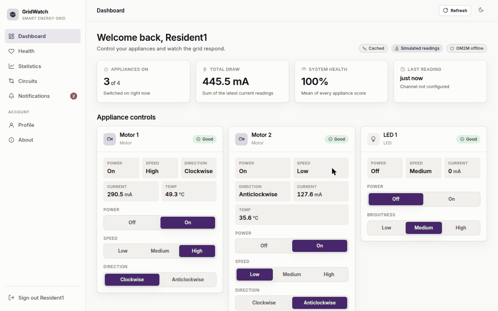
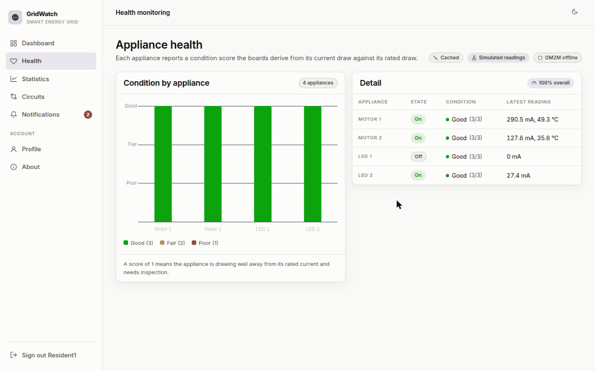
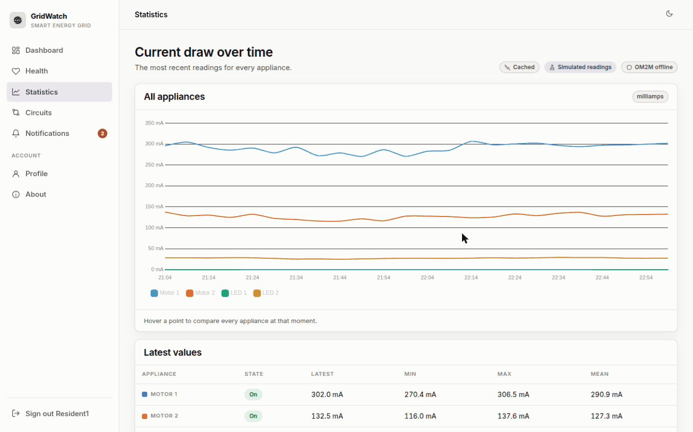
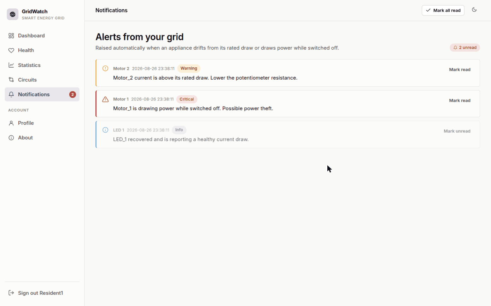
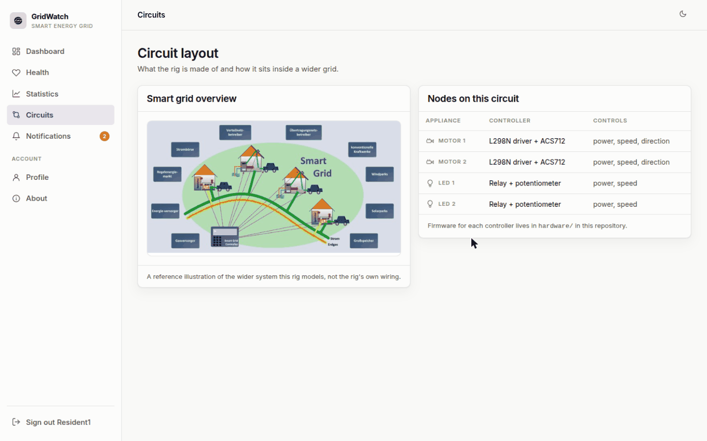
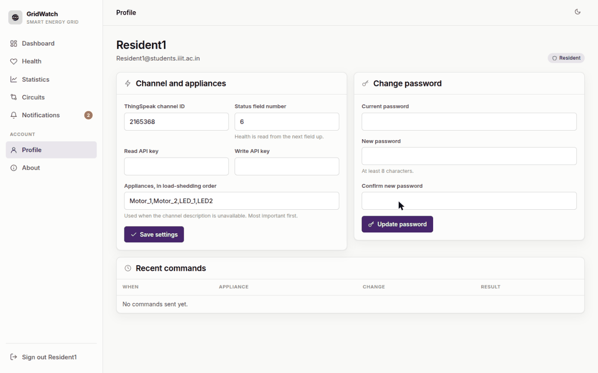
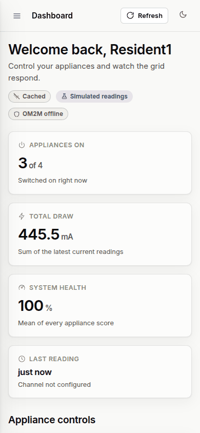
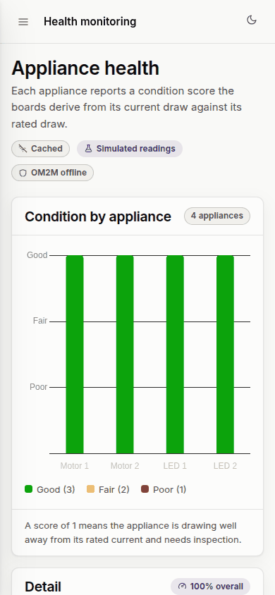
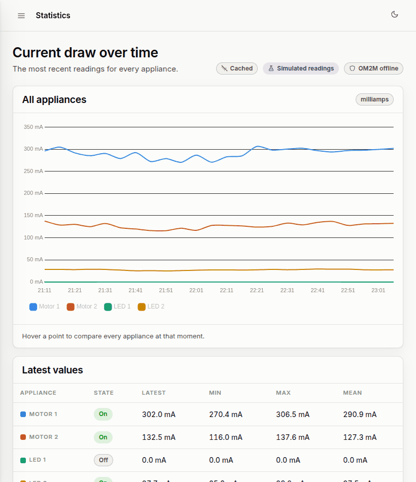

<!-- Generated from README.md by scripts/build_light_readme.py. Do not edit by hand. -->

<div align="center">

<picture>
  <source media="(prefers-color-scheme: dark)" srcset="./docs/assets/adk_dev_logo_light.png">
  
</picture>

# GridWatch

**A web front end for a smart energy grid rig: it shows what every appliance on the circuit is doing, scores its condition, raises alerts when something looks wrong, and lets a resident switch appliances on and off from anywhere.**


<br>


<br><br>

**[Developer documentation](./DEVDOC.md)** · [Features](#features) · [Running it](#running-it)

<p><b>Light mode</b> · <a href="./README.md">View this page in dark mode</a></p>

</div>

---

The rig itself is a set of ESP boards driving motors, LEDs and buzzers through
relays, with current and temperature sensors on each branch. Readings go to a
ThingSpeak channel; control commands come back through an OM2M gateway or the
same channel. GridWatch is the part a person looks at.

## Contents

- [Why this project matters](#why-this-project-matters)
- [Screenshots](#screenshots)
- [Responsive layout](#responsive-layout)
- [Features](#features)
- [Roles](#roles)
- [Where the data comes from](#where-the-data-comes-from)
- [Demo accounts](#demo-accounts)
- [Running it](#running-it)
- [Repository layout](#repository-layout)
- [Tech stack](#tech-stack)
- [Contributors](#contributors)
- [License](#license)

---

## Why this project matters

A teaching rig is only useful if you can see what it is doing, and hardware has a
habit of being unavailable exactly when you want to demonstrate it. The boards
are off, the gateway is down, the channel has not been written to for a week.

So the interesting design decision here is that **GridWatch never has nothing to
show**. It reads live telemetry when the channel answers, falls back to the last
cached reading when it does not, and falls back again to a deterministic
simulation derived from each appliance's rated draw. The badges at the top of
every page say which of the three you are looking at, so a simulated reading is
never mistaken for a real one.

The health score works the same way: it is not a sensor value but a comparison
between what an appliance is drawing and what it should draw at its current
setting. That is what makes "Motor_1 is drawing power while switched off,
possible power theft" something the app can say on its own.

## Screenshots

Every image is a real 1440x900 viewport render against the seeded demo account.
This page shows **light mode**; the same gallery in dark mode is at **[README.md](./README.md)**.

<table>
  <tr>
    <td width="33%" valign="top">
      
      <p align="center"><b>Dashboard</b><br><sub>Live controls for power, speed and direction per appliance.</sub></p>
    </td>
    <td width="33%" valign="top">
      
      <p align="center"><b>Health</b><br><sub>Condition scored from draw against rated draw.</sub></p>
    </td>
    <td width="33%" valign="top">
      
      <p align="center"><b>Statistics</b><br><sub>Current over time, with min, max and mean per appliance.</sub></p>
    </td>
  </tr>
  <tr>
    <td width="33%" valign="top">
      
      <p align="center"><b>Notifications</b><br><sub>Raised automatically when an appliance drifts from its rating.</sub></p>
    </td>
    <td width="33%" valign="top">
      
      <p align="center"><b>Circuits</b><br><sub>What drives what, and where the firmware lives.</sub></p>
    </td>
    <td width="33%" valign="top">
      
      <p align="center"><b>Profile</b><br><sub>Channel, API keys and the load-shedding order.</sub></p>
    </td>
  </tr>
</table>

## Responsive layout

Each image is a single render at that exact viewport, not a scaled-down desktop shot.

<table>
  <tr>
    <td width="28%" valign="top">
      
      <p align="center"><b>Phone, 390x844</b><br><sub>The sidebar collapses behind a menu button.</sub></p>
    </td>
    <td width="28%" valign="top">
      
      <p align="center"><b>Phone, Health</b><br><sub>The chart keeps its axis labels at full width.</sub></p>
    </td>
    <td width="44%" valign="top">
      
      <p align="center"><b>Tablet, 820x950</b><br><sub>The table keeps every column; nothing is dropped.</sub></p>
    </td>
  </tr>
</table>

## Features

### Dashboard
- Every appliance as a card: power, speed, direction, current draw, temperature.
- Switch power, speed and direction from the card. The change is pushed to the
  hardware and the page updates without a reload.
- Summary tiles for appliances on, total draw, overall health and the age of the
  most recent reading.
- The page keeps polling in the background, and stops while the tab is hidden.

### Health
- A condition score of 1 to 3 per appliance, shown as a chart and as a table.
- The rig reports 0 for appliances it has not scored; those gaps are filled in
  and labelled rather than left blank.

### Statistics
- Current draw per appliance over time, all series on one axis with a shared
  crosshair.
- Latest, minimum, maximum and mean per appliance underneath.

### Notifications
- Raised automatically: an appliance drawing power while switched off reads as
  theft; draw drifting from the rated current reads as wear.
- The same alert is not raised twice within half an hour.
- Mark individual alerts read or unread, or clear them all.

### Profile
- Change the ThingSpeak channel, field number and API keys.
- Set the appliance list and its load-shedding order.
- Change your password.
- See the last ten control commands and whether they were delivered.

### Administration
- An administrator sees every resident: channel, appliances on, total draw,
  health, unread alerts and whether their data is live.

## Roles

| Role | Can do |
|---|---|
| **Resident** | Everything above for their own channel |
| **Administrator** | The same, plus a read-only view of every resident |

## Where the data comes from

Each page tells you what it is showing:

| Badge | Meaning |
|---|---|
| **Live** | Appliance state was read from ThingSpeak just now |
| **Cached** | ThingSpeak had nothing, so the last state GridWatch recorded is shown |
| **Simulated readings** | The boards have not published recently, so sensor values and health scores are stand-ins derived from the appliance state |
| **OM2M** / **OM2M offline** | Whether the local gateway is reachable |

Simulation exists so the interface is legible when the rig is powered down. It is
always labelled, and `GRIDWATCH_SIMULATE=0` turns it off, at which point empty
readings show as empty.

## Demo accounts

A fresh database is seeded with:

| Email | Password | Role |
|---|---|---|
| `Resident1@students.iiit.ac.in` | `password1` | Resident |
| `Resident2@students.iiit.ac.in` | `password2` | Resident |
| `admin@students.iiit.ac.in` | `admin` | Administrator |

These are demo credentials for a teaching rig. Change them before running this
anywhere that matters.

## Running it

```bash
python3 -m venv .venv
.venv/bin/pip install -r requirements.txt
.venv/bin/python run.py
```

Then open http://127.0.0.1:5000. The database is created and seeded on first run.

## Repository layout

| Path | What is in it |
|---|---|
| `gridwatch/` | The Flask application |
| `tests/` | Test suite |
| `hardware/` | Arduino sketches for the ESP boards |
| `legacy/smart_grid_php/` | The original PHP site, kept for reference |
| `legacy/om2m-database/` | H2 database files from the OM2M gateway |
| `docs/` | Project presentation |

## Tech stack

Python 3.12, Flask 3, SQLite, Jinja templates, hand-written CSS with light and
dark themes, and Chart.js for the charts. No build step and no front-end
framework.

## Contributors

<table>
  <tr>
    <td align="center">
      <a href="https://github.com/Dileepadari">
        
        <br><sub><b>Dileep Adari</b></sub>
      </a>
      <br><sub>Author and maintainer</sub>
    </td>
  </tr>
</table>

## License

MIT. See [LICENSE](./LICENSE).
